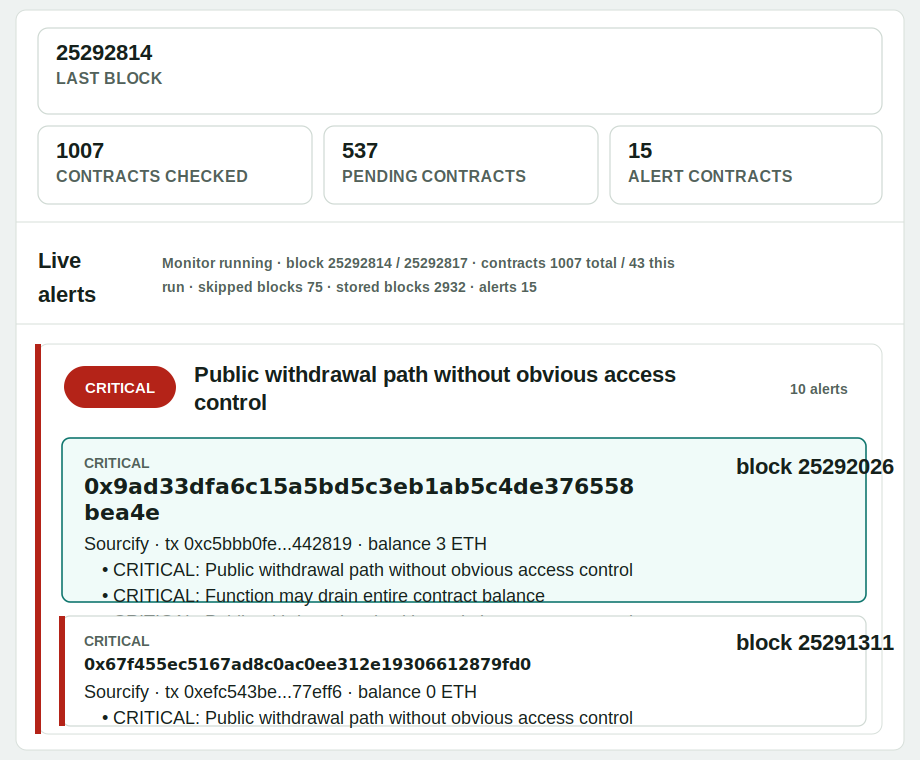

# SmartGuard Auditor

SmartGuard Auditor is a local FastAPI prototype for live smart contract monitoring and Solidity security triage. It combines RPC block scanning, verified source retrieval, heuristic analysis, optional local Ollama review, SQLite persistence, and a browser UI.

The app opens in **Live blockchain** mode by default and the backend can autostart the monitor when `uvicorn` starts.

## Features

- Live Ethereum contract-creation monitoring through JSON-RPC.
- Default live lookback of the latest `100` blocks.
- Automatic monitor autostart on FastAPI startup.
- Public RPC presets for Ethereum mainnet and Sepolia.
- Verified Solidity source retrieval from Sourcify, with optional Etherscan fallback.
- Local heuristic analysis for high-risk withdrawal patterns.
- HIGH/CRITICAL alert creation for risky analyzed contracts.
- Async Ollama comments: the monitor keeps scanning while Ollama reviews reports in the background.
- Recent contracts view with `detected`, `pending source`, and `analyzed` states.
- Full Solidity source display for newly analyzed verified contracts.
- SQLite persistence for scanned blocks, contracts, reports, and alerts.
- Local file audit mode for pasted or dropped Solidity files.

## Quick Start

```bash
python3 -m venv .venv
. .venv/bin/activate
pip install -r requirements.txt
uvicorn app.main:app --reload --host 0.0.0.0 --port 8000
```

Open:

```text
http://localhost:8000
```

By default the backend starts the live monitor automatically with:

- `chain_id = 1`
- `rpc_url = https://rpc.flashbots.net`
- `lookback_blocks = 100`
- `poll_interval = 20`
- `max_blocks_per_tick = 12`
- `analyze_llm = true`
- `llm_model = llama3.2:latest`

## Ollama Installation

Ollama is optional, but recommended. Without Ollama, heuristic analysis still works; only the LLM comment will be missing or queued/empty.

### Linux

```bash
curl -fsSL https://ollama.com/install.sh | sh
ollama serve
```

In another terminal:

```bash
ollama pull llama3.2:latest
```

### macOS

Install Ollama from:

```text
https://ollama.com/download
```

Then pull the model:

```bash
ollama pull llama3.2:latest
```

### Windows

Install Ollama from:

```text
https://ollama.com/download
```

Then in PowerShell:

```powershell
ollama pull llama3.2:latest
```

### Verify Ollama

```bash
curl http://127.0.0.1:11434/api/tags
```

Optional direct generation test:

```bash
curl -s -X POST http://127.0.0.1:11434/api/generate \
  -H "content-type: application/json" \
  -d '{"model":"llama3.2:latest","prompt":"Say OK only","stream":false}'
```

## Configuration

The backend uses environment variables for live monitor autostart and LLM configuration.

| Variable | Default | Description |
| --- | --- | --- |
| `LIVE_AUTOSTART` | `true` | Start live monitoring when FastAPI starts. |
| `LIVE_RPC_URL` | default RPC for chain | RPC URL used by autostart. |
| `LIVE_CHAIN_ID` | `1` | Chain ID, e.g. `1` for Ethereum mainnet. |
| `LIVE_POLL_INTERVAL` | `20` | Seconds between polling ticks. |
| `LIVE_LOOKBACK_BLOCKS` | `100` | Blocks scanned backwards from the latest block when no start block is set. |
| `LIVE_START_BLOCK` | unset | Explicit first block for autostart. Overrides lookback when set. |
| `LIVE_MAX_BLOCKS_PER_TICK` | `12` | Max blocks scanned per monitor tick. |
| `LIVE_ANALYZE_LLM` | `true` | Queue Ollama comments for analyzed verified contracts. |
| `LIVE_LLM_MODEL` | `llama3.2:latest` | Ollama model used by live monitor. |
| `OLLAMA_MODEL` | `llama3.2:latest` | Default model for file/address analysis. |
| `OLLAMA_URL` | `http://localhost:11434/api/generate` | Ollama generation endpoint. |
| `ETHERSCAN_API_KEY` | unset | Optional fallback for verified source lookup. |
| `LOG_LEVEL` | `DEBUG` | Backend logging level. |
| `SMARTGUARD_API_TOKEN` | unset | Optional API token. When set, mutating/costly POST endpoints require `X-API-Token` or `Authorization: Bearer ...`. |
| `CORS_ORIGINS` | local origins | Comma-separated allowed browser origins. |
| `MAX_SOURCE_CHARS` | `500000` | Maximum Solidity source length accepted by `/api/analyze`. |
| `MAX_UPLOAD_BYTES` | `1000000` | Maximum uploaded file size for `/api/analyze-file`. |
| `MAX_LOOKBACK_BLOCKS` | `1000` | Maximum accepted live lookback. |
| `MAX_BLOCKS_PER_TICK` | `25` | Maximum accepted live scan batch size. |
| `MAX_POLL_INTERVAL` | `3600` | Maximum accepted live polling interval in seconds. |
| `MAX_STORED_SOURCE_CHARS` | `120000` | Maximum Solidity source characters stored in SQLite report JSON. |

Example:

```bash
LIVE_LOOKBACK_BLOCKS=500 \
LIVE_POLL_INTERVAL=10 \
ETHERSCAN_API_KEY=your_key \
uvicorn app.main:app --reload --host 0.0.0.0 --port 8000
```

Protected API example:

```bash
SMARTGUARD_API_TOKEN=change-me uvicorn app.main:app --host 127.0.0.1 --port 8000
curl -X POST -H "X-API-Token: change-me" http://127.0.0.1:8000/api/live/clear
```

Disable autostart:

```bash
LIVE_AUTOSTART=false uvicorn app.main:app --reload --host 0.0.0.0 --port 8000
```

## Live Monitor Flow

1. The monitor selects a working RPC endpoint.
2. It reads the latest block number with `eth_blockNumber`.
3. If no explicit start block is set, it starts at `latest - lookback_blocks`.
4. It reads blocks with `eth_getBlockByNumber`.
5. It finds contract creation transactions where `to == null`.
6. It retrieves contract addresses from transaction receipts.
7. Each new contract is saved as `detected`.
8. The monitor tries to fetch verified Solidity from Sourcify, then Etherscan if an API key is available.
9. If no source is available, the contract becomes `pending_source`.
10. Pending contracts are retried periodically.
11. If verified Solidity is available, the contract is analyzed heuristically and saved as `analyzed`.
12. If the heuristic risk is `HIGH` or `CRITICAL`, an alert is stored.
13. If Ollama is enabled, the LLM review is queued in the background and later written back to the contract and alert report.

Important: blockchain RPC provides bytecode, not full Solidity. Full source-level auditing requires verified source from Sourcify or Etherscan.

## Example Detected Alerts

These examples show the kind of output SmartGuard creates when a verified Solidity contract matches a risky pattern. They are not static demo cards: in live mode the monitor finds contract creation transactions, fetches verified source when available, runs the heuristic analyzer, stores the report, and creates an alert for `HIGH` or `CRITICAL` risk.

### Live Run Snapshot

SmartGuard has been run against Ethereum mainnet and produced live results like this:



This confirms the live monitor is doing real work end to end: reading blocks, finding new contract deployments, resolving verified source, running the analyzer, grouping alerts, and showing contracts that deserve manual review.

### CRITICAL: Possible Reentrancy

Pattern:

```solidity
function withdraw() external {
    uint256 amount = balances[msg.sender];
    (bool ok,) = msg.sender.call{value: amount}("");
    require(ok);
    balances[msg.sender] = 0;
}
```

Why it alerts:

- an external value call happens before the balance is updated,
- the function is user-callable,
- the same caller may be able to re-enter before their accounting is cleared.

Typical finding:

```text
CRITICAL Possible Reentrancy
External call happens before state update.
Recommendation: update balances before the external call and add nonReentrant.
```

### CRITICAL: Public Withdrawal Path Without Obvious Access Control

Pattern:

```solidity
function sweep(address token, uint256 amount) external {
    IERC20(token).transfer(msg.sender, amount);
}
```

Why it alerts:

- a public or external function transfers funds,
- no visible `onlyOwner`, role check, privileged wallet check, or `msg.sender` accounting limit was detected,
- this can indicate an open drain path.

Typical finding:

```text
CRITICAL Public withdrawal path without obvious access control
A public/external function transfers funds, but no role, owner, or sender balance check was detected.
Recommendation: add explicit authorization or prove user-specific accounting limits the payout.
```

### HIGH: Unchecked Low-Level Call Result

Pattern:

```solidity
function payout(address payable receiver, uint256 amount) external onlyOwner {
    receiver.call{value: amount}("");
}
```

Why it alerts:

- low-level ETH transfer can fail,
- the return value is not checked,
- accounting or business logic may continue as if the payout succeeded.

Typical finding:

```text
HIGH Unchecked low-level call result
A low-level value call can fail without reverting unless its result is checked.
Recommendation: capture the boolean result and revert when the transfer fails.
```

### MEDIUM/HIGH: Token Rug or Honeypot Signals

Pattern examples:

```solidity
require(_taxFee <= 99);
assembly { let caller := origin() }
modifier gate() { if (blocked[msg.sender]) return; _; }
```

Why it alerts:

- owner-controlled taxes can make selling economically impossible,
- `tx.origin`-style logic can behave differently through routers,
- modifiers that silently return can break expected ERC20 behavior.

These are usually trust or honeypot indicators, not always public exploits. The UI shows them separately from direct withdrawal bugs so they can be manually reviewed.

## Contract States

- `detected`: contract creation was found, but source lookup has not completed yet.
- `pending_source`: contract was found, but no verified Solidity source is available yet.
- `analyzed`: verified Solidity was found and the heuristic audit ran.

## Heuristic Rules

The analyzer currently looks for:

- possible reentrancy: external value call before state update,
- Ether transfer without a visible `nonReentrant` guard,
- public withdrawal paths without obvious access control,
- unchecked low-level `call` / `send` results,
- functions that may drain the full contract balance,
- `tx.origin` authorization,
- `delegatecall`,
- `selfdestruct` / `suicide`,
- transfers inside loops,
- time-dependent payout logic.

Some common false positives are intentionally reduced:

- standard ERC20 `transferFrom` is not treated as a public withdrawal by itself,
- account-bound pull-payment patterns such as `balances[msg.sender]` are downgraded when state is updated before the external call.

## Ollama Behavior

Ollama does **not** decide whether an alert exists. Alerts are created by heuristics.

Ollama receives:

- heuristic findings,
- risk level,
- verified Solidity source excerpt.

It returns an audit note with:

- confirmed vulnerabilities,
- possible false positives,
- manual review suggestions.

For live monitoring, Ollama runs asynchronously. A report may show `llm_status = queued` while the monitor continues fetching blocks.

Possible `llm_status` values:

- `queued`: the background Ollama job has been scheduled.
- `done`: Ollama returned and stored a comment.
- `empty`: Ollama responded but returned no text.
- `error`: Ollama failed, timed out, or returned invalid data; `llm_error` contains the backend error.
- `interrupted`: the backend restarted before the queued job finished.

## UI Overview

The app starts in **Live blockchain** mode.

Live controls:

- `RPC URL`
- `RPC preset`
- `Chain ID`
- `Interval`
- `Start live`
- `Stop`
- `Analyze live with Ollama`
- `Lookback blocks`
- `Start block`
- `Etherscan API key`
- `Model live LLM`
- `Test RPC`
- `Clear alerts`

Panels:

- `Alerts live`: grouped HIGH/CRITICAL alerts.
- `Recent contracts`: all recently detected contracts.
- `Details`: selected alert or contract, including metadata, findings, LLM comment, functions, and Solidity code when available.

## API Endpoints

- `GET /health`
- `POST /api/analyze`
- `POST /api/analyze-address`
- `POST /api/analyze-file`
- `POST /api/rpc/test`
- `POST /api/live/start`
- `POST /api/live/stop`
- `POST /api/live/clear`
- `GET /api/live/status`
- `GET /api/live/alerts`
- `GET /api/live/contracts`

## Persistence

SQLite database:

```text
data/smartguard.sqlite3
```

Stored data:

- scanned blocks,
- seen contracts,
- pending source contracts,
- full reports for newly analyzed contracts,
- alerts,
- LLM status and comments when available.

To keep SQLite from growing too quickly, stored `source_code` is capped by `MAX_STORED_SOURCE_CHARS`. Reports include `source_truncated` and `source_chars` when the full verified source was larger than the stored excerpt.

Previously stored records may not contain fields added later, such as `source_code`, `source_truncated`, or full `report_json`. New records after backend restart will include them.

## License

MIT License. See [LICENSE](LICENSE).

## Docker

```bash
docker compose up --build
```

If Ollama runs on the host, set `OLLAMA_URL` so the container can reach it.

Docker Desktop example:

```bash
OLLAMA_URL=http://host.docker.internal:11434/api/generate docker compose up --build
```

On Linux, use the host gateway address appropriate for your Docker setup.

## Tests

```bash
python3 -m unittest discover -s tests
```

Basic syntax check:

```bash
python3 -m py_compile app/analyzer.py app/monitor.py app/main.py app/storage.py app/llm.py
```

## Troubleshooting

### Everything is `pending_source`

This means contracts are detected, but verified Solidity source was not found yet.

Common reasons:

- contracts are very fresh,
- Sourcify has no verified source yet,
- no `ETHERSCAN_API_KEY` is configured,
- explorer APIs are rate-limited.

Solutions:

- add `ETHERSCAN_API_KEY`,
- wait for verification and retries,
- scan older blocks,
- increase `LIVE_LOOKBACK_BLOCKS`.

### LLM comment is missing

Check:

- `ollama serve` is running,
- `llama3.2:latest` is pulled,
- `OLLAMA_URL` points to the right endpoint,
- backend logs for `ollama request start`, `ollama request done`, or warning messages.

### RPC test fails

Try another preset or provide your own RPC URL. Public RPC endpoints may rate-limit requests.

## Roadmap Ideas

- Bytecode decompilation fallback for unverified contracts.
- Better protocol-aware heuristics for ERC20/ERC4626/DEX/lending contracts.
- RAG with OWASP/SWC/exploit knowledge.
- PDF export.
- Historical analysis views.
- Multi-agent review roles such as Security Expert, Gas Optimizer, and Business Logic Reviewer.
